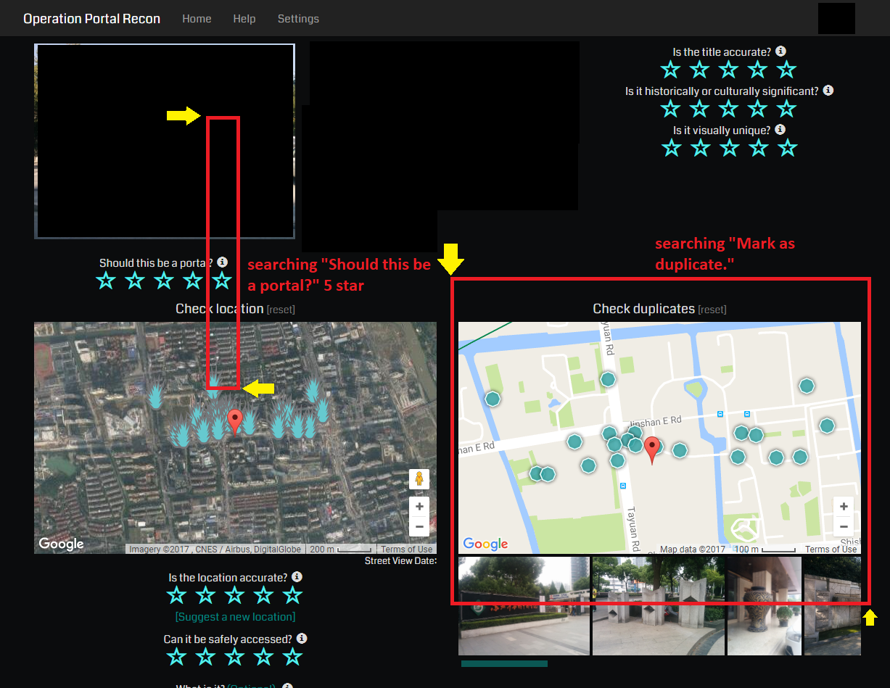

# User Manual 使用手册

### Pre
0. This code is for Windows PC.
* 只支持Windows系统。
1. Copy `opr.exe`, `windowspy.exe`, `coor.txt`, `coor_real.txt`, `dup.png`, `star.png` and `template` folder in root folder to a new directory.
* 把根目录的 `opr.exe`, `windowspy.exe`, `coor.txt`, `coor_real.txt`, `dup.png`, `star.png` 以及`template`文件夹复制到新的一个文件夹里。
2. In your own OPR Portal Analysis page, screen shot one of the **star** and **Mark as duplicate** button. After screen shot, use Windows pre-installed software **Paint** or any software you like to cut out the black edge of them. Make sure your outcome is similar to the provided `dup.png` and `star.png`. Then save them as `star.png` & `dup.png` and replace the existing one.
* 打开你的**OPR能量塔分析**页面，截**单个星星**和**Mark as duplicate**按钮的图。然后参考已经有的`star.png`和`dup.png`图，用windows自带的画图或者PS把图片的黑边裁剪掉。
3. You can check out the `template` folder, and find whether there is a resolution similar to yours. If there is one, copy it out and rename & cover the existing `coor_real.txt`. Open `opr.exe`, enable function by `Ctrl+Shift+o`, try some rating function to checkout the basic mechanism in [Control](#control). (This step may not working since you may need your own `coor_real.txt`. If any warning happens, just ignore this step. Or it works totally fine, you can skip following step)
* 在`template`文件夹寻找有没有和你的屏幕一样的分辨率，有的话把对应的`txt`复制出来改成并覆盖掉原有的`coor_real.txt`，打开`opr.exe`，按`Ctrl+Shift+o`来初始化程序，然后按照 [Control](#control) 来进行打分操作。如果一切良好，恭喜你，此教程结束。如果没有对应`txt`或者打分失败，请进行下一步。
4. Open the `coor_real.txt` and `windowspy.exe`, use the `windowspy.exe` to make your own `coor_real.txt` according to [Setting](#setting).
* 打开`coor_real.txt` 和 `windowspy.exe`，根据[Setting](#setting)用`windowspy.exe`来自定义你的`coor_real.txt`。
5. Once you made your own coordinate `coor_real.txt`, make a copy of the it (save it to the template directory).
* 当你有了你自己的`coor_real.txt`时，保存一份到`template`文件夹（推荐在本repository的issue里面发给作者加到本repository里）。
6. Open `opr.exe` and enable function by `Ctrl+Shift+o`, then you can start your OPR.
* 打开`opr.exe`，按`Ctrl+Shift+o`来初始化程序，然后按照 [Control](#control) 来进行打分操作。

### Control
- `Ctrl+Shift+o`: set up the coordinate (automatically generate the `coor.txt`), and enable or disable the whole function 初始化坐标，以及功能开关
- `Ctrl+Shift+p`: User manual and current state 程序是否被使能
- `z`: 1 star
- `a`: duplicate (left click on the duplicated picture by yourself) 标重，需要先点击相应的图片
- `x`: 2 star (not very good) 不咋样
- `s`: 2 star (ordinary and bad location) 凑合，位置完全没谱
- `c`: 3 star (overall not very good and not very bad) 凑合
- `d`: 3 star (very good but not correct location by street view) 不错，就是位置没谱
- `v`: 4 star (good but not perfect) 还行
- `f`: 4 star (very good but indoor position) 不错，就是因为室内位置拿不准
- `b`: 5 star (very good with visual 5* culture 4* position 4*) 因为好看5星
- `g`: 5 star (very good with visual 4* culture 5* position 4*) 因为历史5星
- `t`: 5 star (perfect with visual 5* culture 5* position 5*) 全5星
- `Space`: submit 提交（以上打分除一星和标重都需要点提交）
- `esc`: stop the script 退出程序

### Setting 
**(number based on my personal setup)** 
All in pixel, all coordinate in Relative mode. "center" is just for the place to click, may not be exactly center of the star or button.
全部为像素值，`windowspy.exe`的`Relative mode`，中心是指点击的位置，不需要是正中心。
- `30`: `star.png` width `star.png`图片的宽
- `26`: `star.png` height `star.png`图片的宽
- `40`: Distance between center of two adjacent star 两个相邻星星在opr页面的正中心的距离（真正的正中心，或者两个的最左边也可以）
- `980`: X coordinate for center of "Submit" button (coordinate when scrollbar at the bottom) 把滚轮拉倒最下面时，`提交`按钮的中心X坐标
- `880`: Y coordinate for center of "Submit" button (coordinate when scrollbar at the bottom) 把滚轮拉倒最下面时，`提交`按钮的中心Y坐标
- `1000`: X coordinate for center of "Analyze Next" button (also for "submit" button around the same place) 弹出的`下一个`按钮的中心X坐标，也是另一个`提交`的位置
- `300`: Y coordinate for center of "Analyze Next" button (also for "submit" button around the same place) 弹出的`下一个`按钮的中心Y坐标，也是另一个`提交`的位置
- `1445`: X coordinate for center of 5 star of "Is the title accurate?" `标题起的精确吗？`第五颗星的中心X坐标
- `170`: Y coordinate for center of 5 star of "Is the title accurate?" `标题起的精确吗？`第五颗星的中心Y坐标
- `220`: Y coordinate for center of 5 star of "Is it historically or culturally significant?" `具有历史或文化特殊意义吗？`第五颗星的中心Y坐标
- `280`: Y coordinate for center of 5 star of "Is it visually unique?" `视觉上独一无二吗？`第五颗星的中心Y坐标
- `760`: X coordinate for center of 5 star of "Is the location accurate?" (coordinate when scrollbar at the bottom) 把滚轮拉倒最下面时，`位置精确吗？`第五颗星的中心X坐标
- `670`: Y coordinate for center of 5 star of "Is the location accurate?" (coordinate when scrollbar at the bottom) 把滚轮拉倒最下面时，`位置精确吗？`第五颗星的中心Y坐标
- `755`: Y coordinate for center of 5 star of "Can it be safely accessed?" (coordinate when scrollbar at the bottom) 把滚轮拉倒最下面时，`可以安全抵达吗？`第五颗星的中心Y坐标
- `640`: X coordinate for upper left point for searching "Should this be a portal?" 5 star (check the figure below) 参考下图，搜索`这可以作为能量塔吗？`的左上角X坐标
- `260`: Y coordinate for upper left point for searching "Should this be a portal?" 5 star 搜索`这可以作为能量塔吗？`的左上角Y坐标
- `690`: X coordinate for lower right point for searching "Should this be a portal?" 5 star 搜索`这可以作为能量塔吗？`的右下角X坐标
- `640`: Y coordinate for lower right point for searching "Should this be a portal?" 5 star 搜索`这可以作为能量塔吗？`的右下角Y坐标
- `970`: X coordinate for upper left point for searching "Mark as duplicate." (check the figure below) 参考下图，搜索`Mark as duplicate.`的左上角X坐标
- `500`: Y coordinate for upper left point for searching "Mark as duplicate." 搜索`Mark as duplicate.`的左上角Y坐标
- `1575`: X coordinate for lower right point for searching "Mark as duplicate." 搜索`Mark as duplicate.`的右下角X坐标
- `900`: Y coordinate for lower right point for searching "Mark as duplicate." 搜索`Mark as duplicate.`的右下角Y坐标

The searching box is not very strict as long as it include the image used to search regardless the changing of the image height. Make sure that star searching box does not contain the #4 star.
这个搜索框要保证包括你截的图，不建议太大，类似下图即可，搜索星星的要保证不包括第四颗星星。

